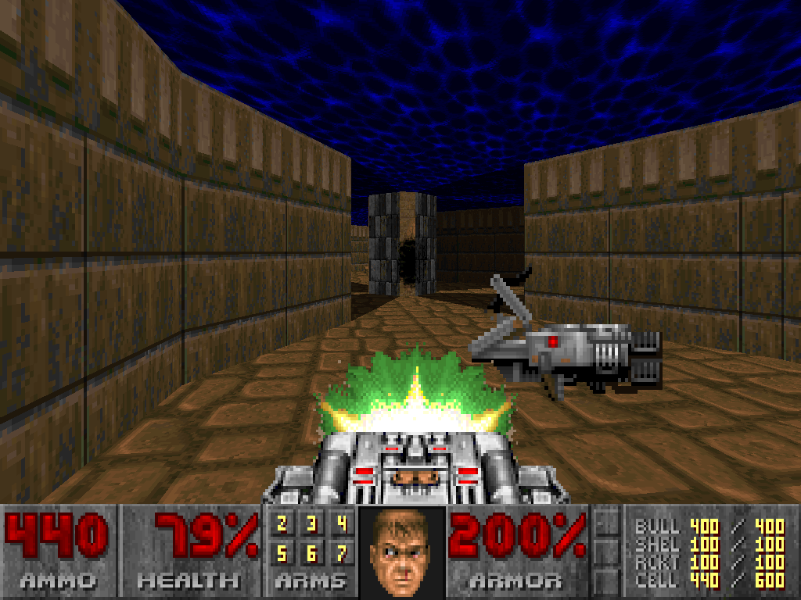

# HERMES Burst Search Tools

The HERMES Burst Search Tools is a software collection of tools for finding transients
in data from the HERMES nanosatellite constellation. This software was developed in a collaboration between
the Italian National Institute for Astrophysics and the Italian Space Agency.

It is composed of a main library, called `hbstools`, and a collection of scripts to interface with it.
HERMES Burst Search Tools uses a changepoint detection algorithm called Poisson FOCuS to search for astrophysical events, see:

* _Ward, K., Dilillo, G., Eckley, I., & Fearnhead, P. (2023). Poisson-FOCuS: An efficient online method for detecting count bursts with application to gamma ray burst detection. Journal of the American Statistical Association, 1-13._
* _Dilillo, G., Ward, K., Eckley, I. A., Fearnhead, P., Crupi, R., Evangelista, Y., Vacchi, A., & Fiore, F. (2023). Gamma-ray burst detection with Poisson-FOCuS and other trigger algorithms. arXiv preprint arXiv:2312.08817._


# Setup
## TL:DR
Make an environment with `venv` and run:

```pip install git+https://github.com/peppedilillo/hbstools.git```

or, if you are on an Anaconda distribution of python, download the `conda-env.yml` and run:

```conda env create -f conda-env.yml```

You're set, great!

BUT STOP A MOMENT. 

Maybe this does not make sense, or you got into some problem. In this case here's the...

## ...Long version

1. If you are unsure whether you are on Anaconda or you are not, open a terminal and type ```which python``` (if on GNU-Linux or Mac) or ```gcm python``` (if on Windows). You should get a path to your Python executable this way. If you see some `anaconda` there (e.g., `C:\Users\username\anaconda3\..`), you are on anaconda, unless you really like snakes.

### If you are on anaconda:

2. Download this repository from the green button on the top right and unzip, or `git clone https://github.com/peppedilillo/hbstools.git` if you have git installed.
3. Move with the terminal to where you downloaded this repo and run `conda env create -f conda-env.yml`. This will create an environment where only hbstools is installed, so that we don't mess with your other packages and they don't mess with us.
4. Activate the environment with `conda activate hbstools`.

That's it. Try `mercury --help` or `import hbstools` from the Python REPL to make sure everything it's working.

### If you are not on anaconda:

2. Make sure you are at least on python 3.11 running on terminal `python3 --version`. If you are on an old version or python, you should [update](https://www.python.org/downloads/) it.
3. Move with terminal where you want to install hbstools, then run `python3 -m venv hbstools-venv`.
4. Activate your virtual environment with `source ./hbstools-venv/bin/activate` (on GNU-Linux and Mac) or `./hbstools-venv/Scripts/activate` (on Windows).
5. Run `pip install git+https://github.com/peppedilillo/hbstools.git`.

Try `mercury --help` or `import hbstools` from the Python REPL to make sure everything it's working.

#### Installing from source

The methods above will fetch the source from this GitHub repo, so you won't be able to change the code yourself with ease.
If you need to interact with the actual code to modify it, or do some other dev work, the process is similiar but you'll need to install from your local copy of the source code. To achieve this:
1. Make sure you have an environment set, you can create a blank one with `python3 -m venv hbstools-venv`;
2. Download this repo and make your changes;
3. To see the effect of your changes `pip install .` within the environment and from the source's folder, or `pip install '.[dev]'` for a bunch of extra useful packages. 

### Running tests:

Activated your environment, then move to the `hbstools/test` folder and run `python -m unittest -v`. 

### Troubleshooting

* For obscure reasons, making the conda environment yourself (e.e. with `conda create -n ..`) and running `git+https://github.com/peppedilillo/hbstools.git` may not set any script (includin `mercury`) in your PATH, so either don't do that (use the `conda-env.yml`, or `pip install .` from source, as we talk above), or add `mercury` to your PATH, as a warning will tell you.
* We provide C code. Don't worry, the installer will take care of compiling that for you but make sure you have a compiler installed on your machine. If you are on Windows, installing Visual Studio should suffice, if you are on Mac install XCode, if you are on GNU-Linux you should be set already.

> ❗ **Always remember to activate your environment**, otherwise you won't be able to use hbstools or mercury.


## Uninstalling

Either run `conda env remove -n hbstools` (if you are using Anaconda) or put the `venv-hbstools` in the trashbin.
If you downloaded the source code you can trash it.

# Algorithms
With HBStools come multiple implementations of Poisson-FOCuS and background estimators.
Some of these were designed for speed, other for flexibility, other for visualization and debugging. 
The algorithm choice depends on your selection of the configuration parameters, which must
meet one of the column in this table:

|               | Python PF+DES | Python BFT | C PF+SES | C BFT |
|---------------|---------------|------------|----------|-------|
| threshold_std |       ✓       |      ✓     |     ✓    |   ✓   |
| mu_min        |       ✓       |      ✓     |     ✓    |   ✓   |
| alpha         |       ✓       |      ✓     |     ✓    |   ✓   |
| beta          |       ✓       |      ✓     |          |       |
| m             |       ✓       |      ✓     |     ✓    |   ✓   |
| t_max         |       ✓       |      ✓     |          |       |
| sleep         |       ✓       |      ✓     |     ✓    |   ✓   |
| majority      |               |      ✓     |          |   ✓   |

For more information on these parameters, try `mercury --drop .`.

### BFT9000



The BFT (Big FOCuS Trigger) is our "flagship" algorithm right now.
It is an optimized C implementation of four Poisson-FOCuS algorithm with automatic background estimate by single exponential smoothing. All algorithms work independently of each other, over data from different detectors. A trigger pass through only if a commandable number of trigger algorithm (majority vote) are found over threshold at the same time. If bad data are passed to one of the algorithms, that algorithm is shut down, but
BFT keeps running untila trigger is found or the number of corrupted algorithms if greater than the voting majority.


# Mercury


Mercury is the first interface to `hbstools`. 
It is a command line tool to automatically search for gamma-ray bursts and other astronomical transients. 

> 💅 **Mercury is best rendered on modern terminal applications.**
> If you are working on windows, we suggest using the [new Windows terminal](https://apps.microsoft.com/store/detail/windows-terminal/9N0DX20HK701).

### Searching for GRBs
A basic usage involves getting into the folder containing the data you want to analyze and running:

```mercury search .```

The program will search directories for one data file and one gti file. 
By default, only the input directory and its subdirectories are searched for data, but you can search deeper using the
`--reclim` option of `mercury search`.

Alternatively, a list of input directory can be passed as a variadic argument. For example:

```mercury search dir1 dir2 --reclim 0```

will search the directories `dir1` and `dir2`, ignoring their subdirectories.
One can use `cat` to search directories listed in a file `input_dirs.txt`:

```mercury search `cat input_dirs.txt` --reclim 0```

### Configuration files
Mercury requires a configuration to work. Even when you run  `mercury search .` a default configuration is loaded.
You can get a configuration stub using:

```mercury drop .```

This will create a commented configuration file which you can later modify with a text editor. 
To run with a custom configuration use the `-c` option flag, e.g. `mercury search -c myconfig.yml`.

### Results
By default, results are saved in the input directory in FITS format.
Using `mercury search . -o myresults-filename.fits` you will change the output file to `myresults-filename.fits`.

There is an alternative output mode which can be selected passing the `--mode library` flag to `mercury search`.
In library mode, mercury will create a directory containing individual files for transients.
These files can be copied into the dataset using the `mercury merge`.
The a merge can be undone, using the `mercury clean` command.

> ❗ **To get help with mercury run `mercury --help`.**
> To get help on a particular command, such as `search`, you call `mercury search --help`.


## Demo dataset
We have uploaded a demo dataset [online](https://drive.google.com/file/d/1kC473-QQsLWrClxKRHT8JJCIJr_KO_4_/view?usp=sharing).
Download the archive and unzip it then, from terminal:

1. `conda activate hbstools`
2. `cd /path_to/demodataset`
3. `mercury search .`

This supposing you installed `hbstools` with Anaconda. 
If you didn't, activate your local environment instead.
